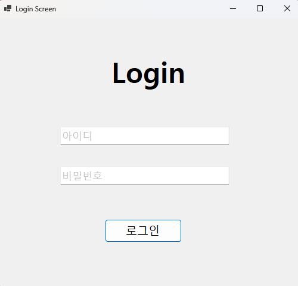
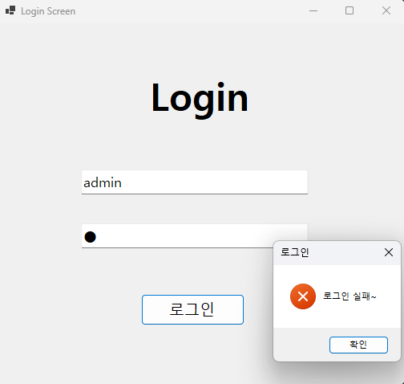
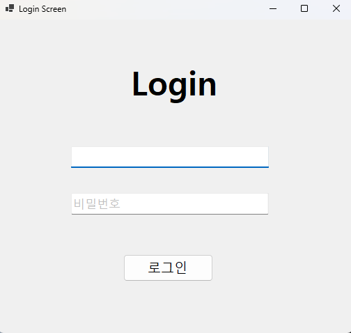
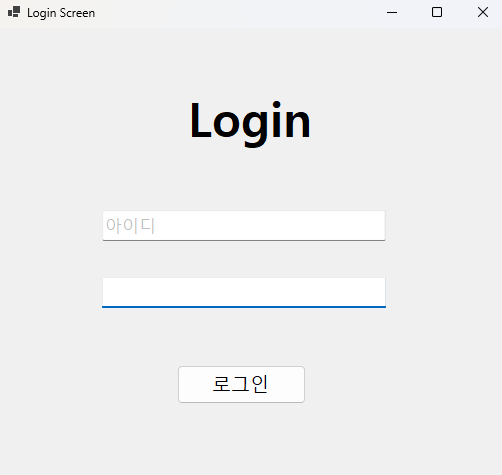
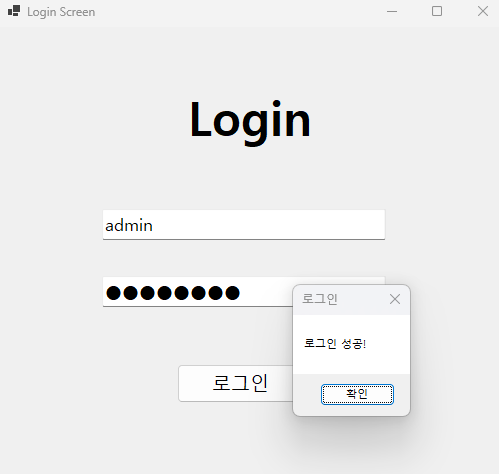

# (C# 코딩) 로그인 스크린

## 개요
- C# 프로그래밍 학습
- 1줄 소개: 로그인 창을 만드르고 아이디와 비밀번호가 맞으면 로그인 성공 메시지 출력, 틀리면 로그인 실패 메시지 출력하는 프로그램
- 사용한 플랫폼: 
    - C#, .NET Windows Forms, Visual Studio, GitHub

## 사용한 컨트롤
- Label: 서비스 명칭 및 입력 항목 안내
- TextBox (txtID, txtPW): 사용자 식별 정보 및 비밀번호 입력 (PasswordChar 적용)
- Button (btnLogin): 입력 데이터 검증 로직 실행

## 사용한 기술과 구현한 기능
- Visual Studio를 이용한 UI 디자인 및 컨트롤 배치
- string 클래스 활용: 
    - 입력 데이터 유효성 검사 (IsNullOrWhiteSpace)
    - 저장된 인증 데이터(myID, myPW)와 사용자 입력값 비교 로직
- 포커스 이벤트 처리 (Enter / Leave):
    - 사용자의 입력 상태에 따른 Placeholder(아이디/비밀번호 안내 문구) 및 색상(Color) 변경
- 키보드 인터럽트 제어 (KeyDown):
    - Enter 키 입력 시 다음 입력창 포커스 이동 및 로그인 버튼 PerformClick() 실행
    - e.SuppressKeyPress를 통한 윈도우 기본 비프음 방지

---

## 실습 내용
1. 이벤트 기반 프로그래밍: 
   컨트롤의 Focus 상태와 KeyDown 이벤트를 연결하여 흐름을 제어하는 방식 학습.

2. 보안 및 편의성 구현: 
   비밀번호 입력 시 UseSystemPasswordChar를 활성화하고, 엔터 키만으로 로그인이 가능한 UX 편의 기능 구현.

## 실행 화면 (과제1)
- 과제1 코드의 실행 스크린샷

- 과제 내용
1. UI 구성
▶ TextBox(아이디, 패스워드), Button(로그인) 등을 적절히 배치합니다.
2. Placeholder 표시
▶ 아이디와 패스워드 입력 힌트를 회색으로 표시
3. 로그인 가능 여부 체크 기능
▶ 아이디와 패스워드가 모두 맞아야 로그인 허용
4. 로그인 성공/실패 메시지 박스 보여주기
▶ 적절한 메시지박스 사용

- 구현 내용과 기능 설명
- 로그인 버튼 클릭 시 입력된 아이디와 패스워드가 저장된 값과 일치하는지 확인하는 로직 구현
- placeholder 기능 구현: TextBox의 Enter 이벤트에서 placeholder 텍스트 제거 및 색상 변경, Leave 이벤트에서 입력이 없을 경우 placeholder 텍스트와 색상 복원
- Enter 키 입력 시 다음 TextBox로 포커스 이동 및 로그인 버튼 클릭 이벤트 실행, 기본 키보드 입력 방지
- UseSystemPasswordChar 속성을 활용하여 패스워드 입력 시 보안 강화